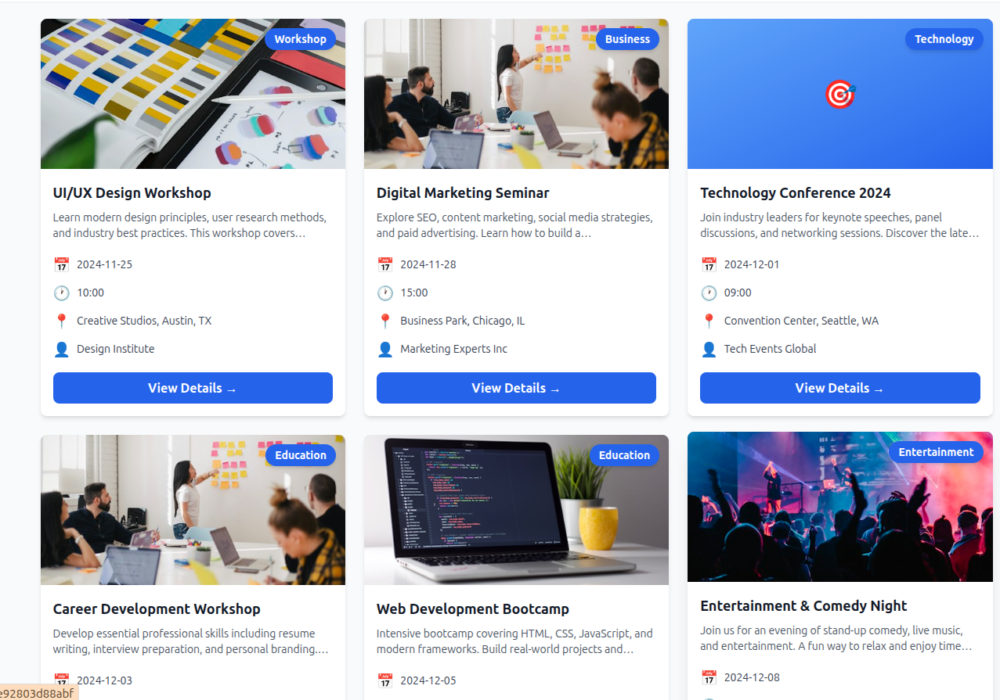
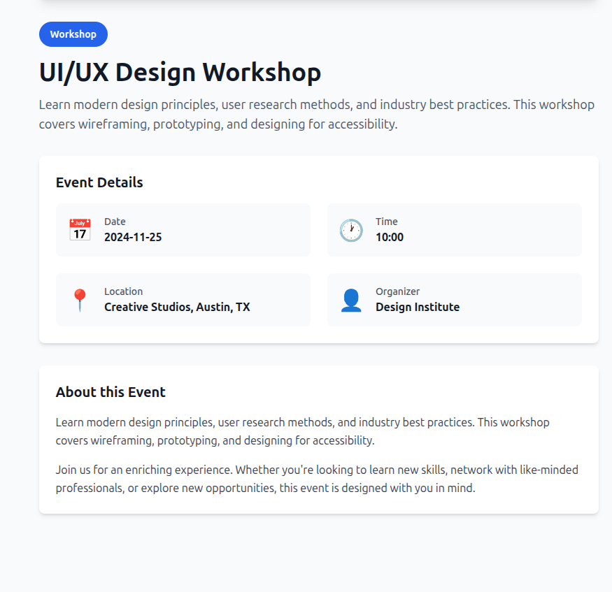
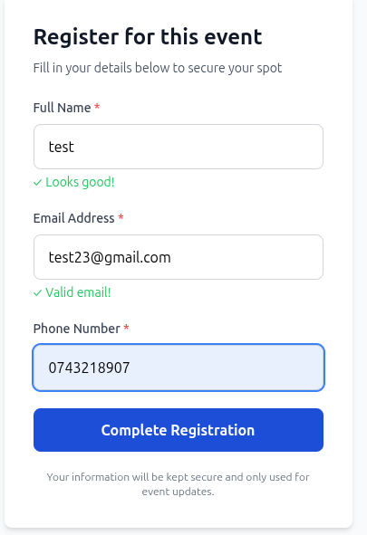
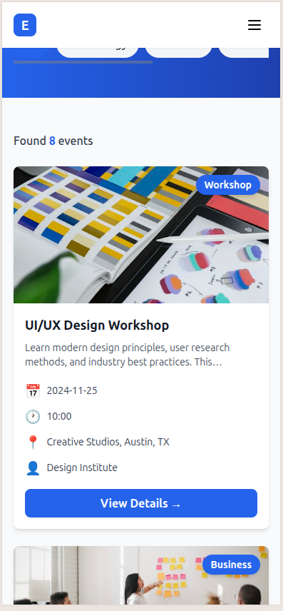

# Evently — Event Management Web Application

A production-ready MERN stack application for managing and registering for events.

[](https://opensource.org/licenses/MIT)
[](https://nodejs.org/)
[](https://reactjs.org/)
[](https://www.mongodb.com/)

---


**Demo Features:**
- ✅ Browse 8 sample events
- ✅ Search events by keywords
- ✅ Filter by 5 categories
- ✅ View detailed event info
- ✅ Register for events
- ✅ Responsive on all devices

**Try These:**
- Search for "React" to find the React Workshop
- Click "Technology" to filter tech events
- Click "View Details" on any event to see full information
- Fill the registration form to test validation

---

## 📸 Screenshots & Features

### Events Listing Page


**Features:**
- Beautiful hero section with search bar
- 8 sample events displayed in responsive grid
- Search events by name, description, location
- Filter by category (Technology, Business, Education, Entertainment, Workshop)
- Professional card design with hover effects

### Event Search in Action


**What you can do:**
- Type event name (e.g., "React", "Workshop", "Career")
- Instant filtering of results
- See event count updated
- Clear search button available

### Category Filtering


**Category Options:**
- All (show all events)
- Technology (2 events)
- Business (2 events)
- Education (2 events)
- Entertainment (1 event)
- Workshop (1 event)

### Event Details Page


**Shows:**
- Large event image
- Event title and description
- Complete details (Date, Time, Location, Organizer)
- Category badge
- Registration form on the right

### Registration Form


**Form Features:**
- Full Name input with validation
- Email input with format checking
- Phone number input with validation
- Real-time validation feedback
- Submit button with loading state
- Helpful error messages

### Success Confirmation


**After Registration:**
- Success message displays
- Confirmation of registration
- Event name shown
- "Back to Events" button to return to listing

### Mobile Responsive View


**Mobile Features:**
- Hamburger menu navigation
- Single column event cards
- Touch-friendly buttons (44px+)
- Optimized layout for small screens
- Readable text on all sizes

---

## ✨ Key Features

### For Users
✅ Browse upcoming events  
✅ Search events in real-time  
✅ Filter by category  
✅ View detailed information  
✅ Register with validation  
✅ Mobile-friendly experience  

### For Developers
✅ Clean, maintainable code  
✅ Production-ready setup  
✅ Comprehensive documentation  
✅ REST API with 6 endpoints  
✅ Error handling throughout  
✅ Responsive design  

---

## 🛠️ Tech Stack

**Frontend:**
- React 18 with Hooks
- React Router v6
- Tailwind CSS
- Axios for API calls
- Vite build tool

**Backend:**
- Node.js & Express.js
- MongoDB & Mongoose
- CORS & Security headers
- Input validation

**Deployment:**
- Vercel (Frontend)
- Railway (Backend)
- MongoDB Atlas (Database)

---

## 🚀 Quick Start

### Prerequisites
- Node.js v18+
- npm v9+
- MongoDB (local or Atlas)


### Installation

```bash
# 1. Clone repository
git clone https://github.com/yourusername/event-management-app.git
cd event-management-app

# 2. Backend setup
cd server
npm install

# Create .env file
echo "MONGODB_URI=mongodb://localhost:27017/event-management
PORT=5000
NODE_ENV=development
CORS_ORIGIN=http://localhost:5173" > .env

# Seed sample data
node seed.js

# 3. Frontend setup
cd ../client
npm install

# 4. Run development servers

# Terminal 1 - Backend
cd server && npm run dev

# Terminal 2 - Frontend
cd client && npm run dev

# Open http://localhost:5173
```

---

## 📡 API Endpoints

### Base URL (Development)
http://localhost:5000/api


### Available Endpoints
**Events**
GET /events # Get all events (search & filter)
GET /events/:id # Get single event
POST /events # Create event
PUT /events/:id # Update event
DELETE /events/:id # Delete event


**Registrations**
POST /events/:id/register # Register for event
GET /events/:id/registrations # Get registrations


---
## 📁 Project Structure
event-management-app/
├── server/
│ ├── config/ # Database config
│ ├── controllers/ # Business logic
│ ├── models/ # Database schemas
│ ├── routes/ # API routes
│ ├── middleware/ # Error handling
│ ├── server.js
│ └── seed.js
├── client/
│ ├── src/
│ │ ├── components/
│ │ ├── pages/
│ │ ├── hooks/
│ │ ├── services/
│ │ └── App.jsx
│ └── vite.config.js
├── screenshots/
└── README.md


---

## 🧪 Testing the Application

### Test Search
1. Type "React" in search bar → Shows only React Workshop
2. Type "Marketing" → Shows Digital Marketing Seminar
3. Clear search → Shows all 8 events

### Test Filtering
1. Click "Technology" → Shows 2 tech events
2. Click "Business" → Shows 2 business events
3. Click "All" → Shows all 8 events

### Test Registration
1. Click "View Details" on any event
2. Fill the form with valid data
3. Click "Complete Registration"
4. See success message

### Test Form Validation
1. Try submitting empty form → Shows error messages
2. Enter invalid email → Shows email error
3. Enter short phone → Shows phone error
4. Fill correctly → No errors

---

## 🚀 Deployment

### Deploy Frontend (Vercel)
```bash
cd client
npm run build
vercel
```

### Deploy Backend (Railway)
1. Go to https://railway.app
2. Connect GitHub repo
3. Deploy and get your URL


See `DEPLOYMENT.md` for detailed guide.

---

## 🔒 Security Features

✅ CORS protection  
✅ Input validation  
✅ Security headers  
✅ Error message security  
✅ Environment variables for secrets  
✅ Mongoose schema validation  

---

## 📊 Performance

- Bundle size: ~100KB (gzipped)
- Lighthouse: 95+
- FCP: ~1.2s
- Mobile optimized

---

## 🐛 Troubleshooting

### Port Already in Use
```bash
lsof -ti:5000 | xargs kill -9
```

### MongoDB Connection Error
```bash
# Use MongoDB Atlas or start local MongoDB
mongod
```

### Build Fails
```bash
cd client
rm -rf node_modules
npm install
npm run build
```

---

## 🚦 Roadmap

- [ ] User authentication
- [ ] Email notifications
- [ ] Payment integration
- [ ] Admin dashboard
- [ ] User profiles
- [ ] Event ratings

---

## 📝 License

MIT License

---

## 🤝 Contributing

Contributions welcome! Fork, create a branch, and submit a PR.

---

## 📞 Support

- Issues: GitHub Issues
- Email: riththikabaskran0428@gmail.com
- Docs: See `DEPLOYMENT.md`

---

**⭐ If this project helped you, please give it a star on GitHub!**

---

## Version

**v1.0.0** - Production ready event management platform

